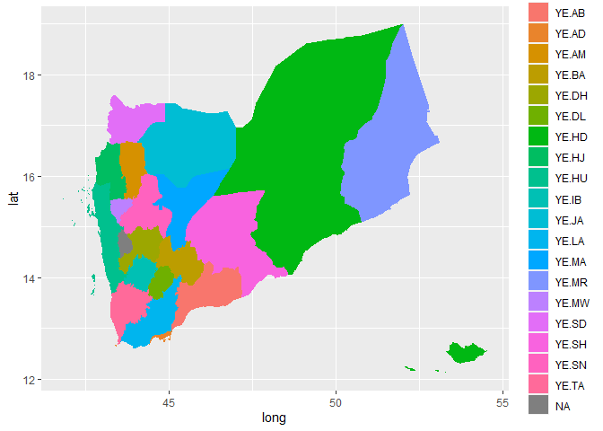

<!-- README.md is generated from README.Rmd. Please edit that file -->

# Lab3package

<!-- badges: start -->
<!-- badges: end -->

The goal of Lab3package is to thin the large shape files and convert it
into a data frame containing Longitude, Latitude, group, order and
NAME\_1 or HASC\_1 so that you can make a polygon figure colored by
region(NAME\_1 or HASC\_1) using this data frame.

## Installation

You can install the development version of Lab3package from
[GitHub](https://github.com/) with:

``` r
# install.packages("devtools")
devtools::install_github("JinjiPang/Lab3package")
```

## Example

This is a basic example to show how to use functions in this package to
create geometric data frame and some implementations.

``` r
library(Lab3package)
#> Registered S3 method overwritten by 'geojsonlint':
#>   method         from 
#>   print.location dplyr
data("Yemen")
```

First, you can download a shape file of a country of your choice. Then,
you can either read the file using `sf::read_sf()`first or just use the
file path to try the following codes:

#### team\_2

This function will return a data frame with four basic variables, which
are long, lat, order, and group.

``` r
library(tidyverse)
#> -- Attaching packages --------------------------------------- tidyverse 1.3.1 --
#> v ggplot2 3.3.5     v purrr   0.3.4
#> v tibble  3.1.6     v dplyr   1.0.7
#> v tidyr   1.1.4     v stringr 1.4.0
#> v readr   2.1.1     v forcats 0.5.1
#> -- Conflicts ------------------------------------------ tidyverse_conflicts() --
#> x dplyr::filter() masks stats::filter()
#> x dplyr::lag()    masks stats::lag()

df1 <- team_2(Yemen, 0.1)

df1 %>%
  ggplot(aes(x = long, y = lat, group = group)) + geom_polygon()
```


#### team\_5

This function will return a data frame with five basic variables, which
are long, lat, order, group, and HASC\_1.

``` r
library(tidyverse)

df2 <- team_5(Yemen, 0.1)

df2 %>%
  ggplot(aes(x = long, y = lat, group = group)) + geom_polygon(aes(fill = HASC_1))
```



#### team\_6

This function will return a data frame with 15 variables, basically it
keeps all the original variables and add three more variables long, lat,
group, order and NAME\_1.

``` r
library(tidyverse)

df3 <- team_6(Yemen, 0.1)

df3 %>%
  ggplot(aes(x = long, y = lat, group = group)) + geom_polygon(aes(fill = NAME_1))
```


